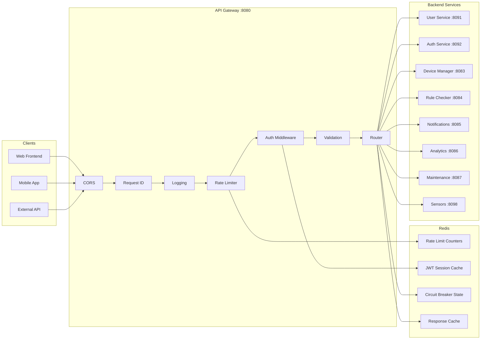
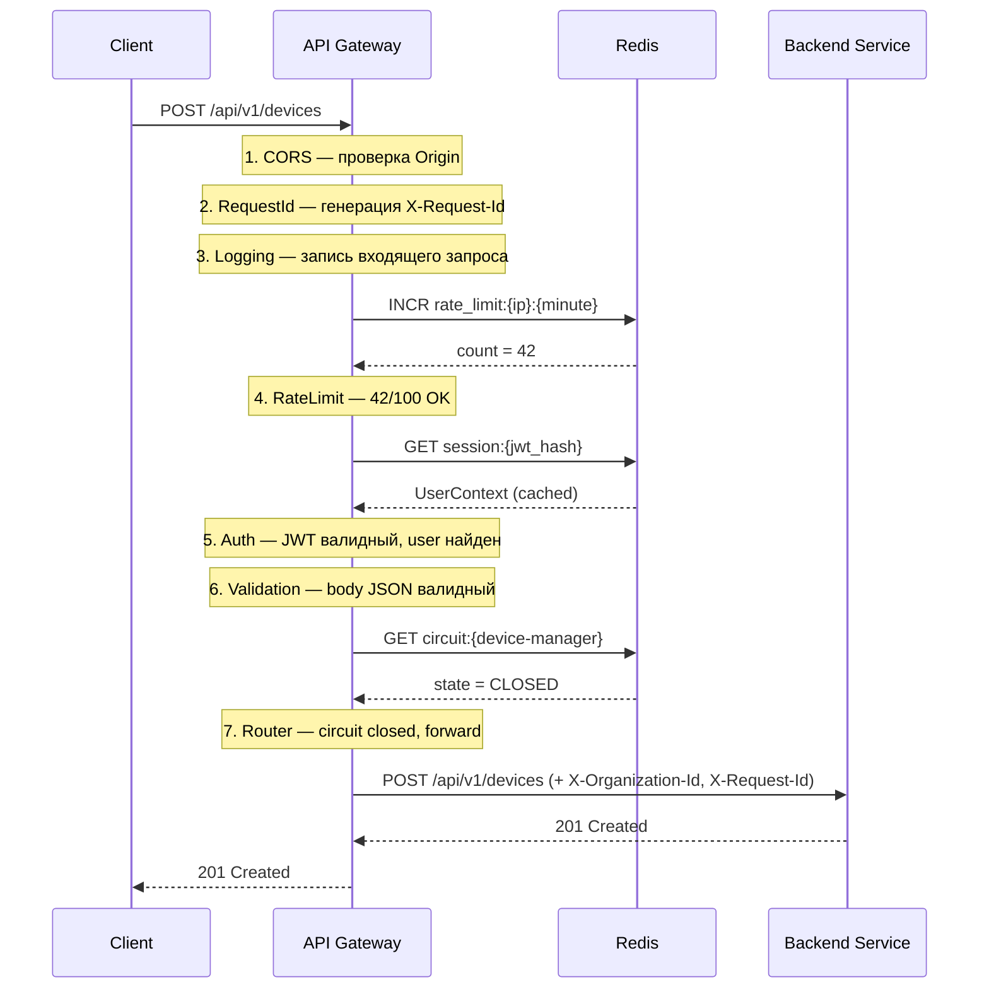
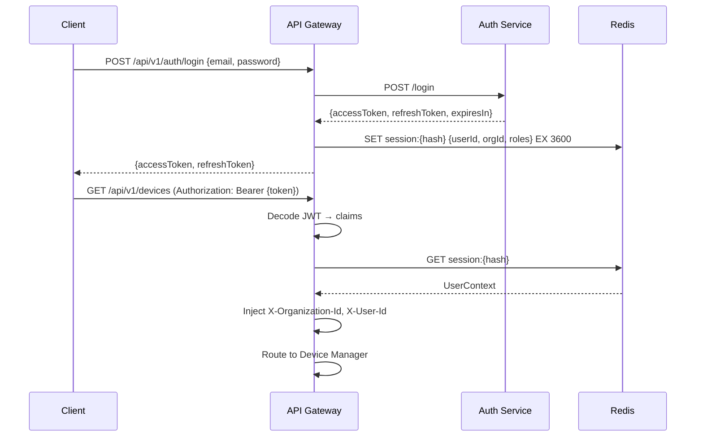
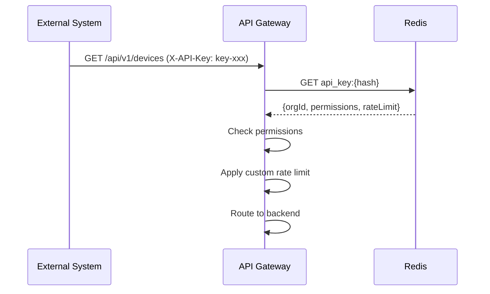
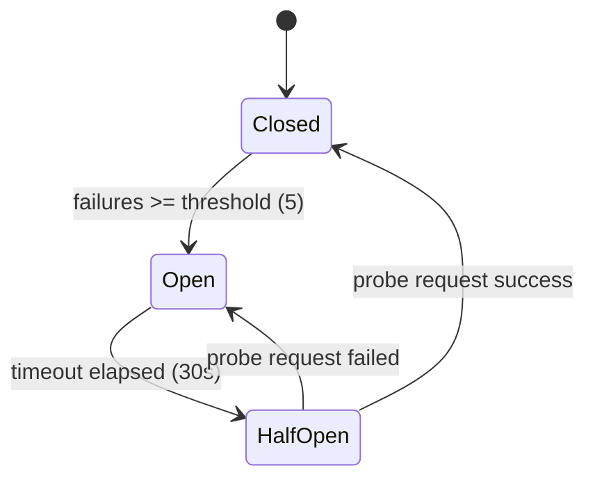
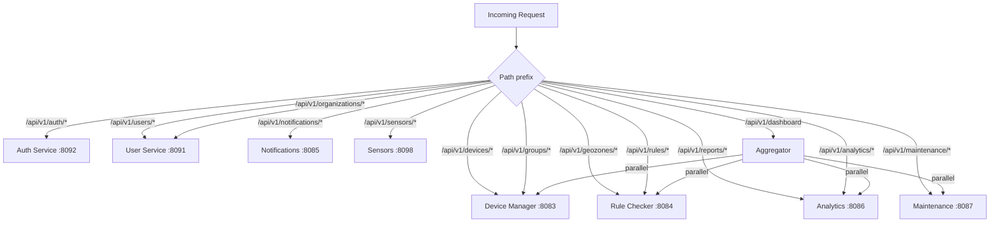

# 🌐 API Gateway — Архитектура

> Тег: `АКТУАЛЬНО` | Обновлён: `2026-06-02` | Версия: `1.0`

## Обзор

API Gateway — единая точка входа для всех клиентских запросов. Реализует аутентификацию,
rate limiting, маршрутизацию и circuit breaker для отказоустойчивости.

## Общая схема



## Middleware Pipeline (детальный)



## Аутентификация

### JWT Flow



### API Key Flow (для интеграций)



## Rate Limiting

### Стратегия: Sliding Window (Redis)

```
Ключ: rate_limit:{identifier}:{window}
TTL: длительность окна

Идентификатор:
- JWT: user:{userId}
- API Key: apikey:{keyId}
- Без auth: ip:{clientIp}
```

### Лимиты по умолчанию

| Тип | Лимит | Окно |
|-----|-------|------|
| Authenticated User | 100 req/min | 1 мин |
| API Key (Standard) | 200 req/min | 1 мин |
| API Key (Premium) | 1000 req/min | 1 мин |
| Unauthenticated | 20 req/min | 1 мин |
| Login endpoint | 5 req/min | 1 мин |

### Headers в ответе

```
X-RateLimit-Limit: 100
X-RateLimit-Remaining: 58
X-RateLimit-Reset: 1717318860
```

## Circuit Breaker



### Параметры per service

| Параметр | Значение | Описание |
|----------|----------|----------|
| `failureThreshold` | 5 | Ошибок до Open |
| `timeout` | 30s | Время в Open до HalfOpen |
| `halfOpenMaxProbes` | 3 | Пробных запросов в HalfOpen |
| `resetTimeout` | 60s | Reset counters после Closed |

### Поведение при Open Circuit

При Open → ответ клиенту:
```json
{
  "error": "service_unavailable",
  "message": "Device Manager temporarily unavailable",
  "retryAfter": 30
}
```
HTTP 503 с заголовком `Retry-After: 30`.

## Router — Маршруты



### Aggregated Endpoint: `/api/v1/dashboard`

Параллельно запрашивает 4 сервиса и агрегирует ответ:

```json
{
  "vehicles": { "total": 150, "online": 120, "offline": 30 },
  "alerts": { "active": 5, "today": 12 },
  "geozones": { "violations": 3 },
  "maintenance": { "overdue": 2, "dueThisWeek": 5 }
}
```

## Структура пакетов

```
com.wayrecall.tracker.gateway/
├── Main.scala
├── config/
│   ├── AppConfig.scala             # Порты, JWT secret, rate limits
│   ├── RouteConfig.scala           # Маршруты к backend сервисам
│   └── ServiceConfig.scala         # Per-service: URL, timeout, circuit breaker
├── domain/
│   ├── UserContext.scala            # userId, orgId, roles
│   ├── ApiKeyContext.scala          # orgId, permissions, rateLimit
│   ├── AuthResult.scala             # sealed trait: Authenticated, ApiKey, Anonymous
│   ├── GatewayRequest.scala         # Обёртка запроса с context
│   ├── GatewayError.scala           # sealed trait: ошибки
│   └── DashboardResponse.scala      # Агрегированный ответ
├── middleware/
│   ├── CorsMiddleware.scala         # CORS headers
│   ├── RequestIdMiddleware.scala    # Генерация X-Request-Id (UUID)
│   ├── LoggingMiddleware.scala      # Логирование входящих/исходящих
│   ├── RateLimitMiddleware.scala    # Sliding window через Redis
│   ├── AuthMiddleware.scala         # JWT decode + session cache
│   └── ValidationMiddleware.scala   # Content-Type, body size
├── service/
│   ├── Router.scala                 # Маршрутизация по prefix
│   ├── ProxyService.scala           # Проксирование к backend
│   ├── CircuitBreaker.scala         # CB per service
│   ├── DashboardAggregator.scala    # Parallel aggregation
│   └── HealthService.scala          # Health check всех backends
├── api/
│   ├── GatewayRoutes.scala          # Все HTTP routes
│   └── HealthRoutes.scala           # GET /health, /metrics
└── redis/
    ├── SessionStore.scala           # session:{jwt_hash}
    ├── RateLimitStore.scala         # rate_limit:{id}:{window}
    ├── ApiKeyStore.scala            # api_key:{hash}
    ├── CircuitBreakerStore.scala    # circuit:{service}
    └── ResponseCache.scala          # cache:{route}:{hash}
```

## ZIO Layer

```scala
val appLayer = ZLayer.make[AppDependencies](
  AppConfig.live,
  RouteConfig.live,
  // Инфраструктура
  RedisClient.live,
  HttpClient.live,
  // Redis stores
  SessionStore.live,
  RateLimitStore.live,
  ApiKeyStore.live,
  CircuitBreakerStore.live,
  ResponseCache.live,
  // Middleware
  CorsMiddleware.live,
  RequestIdMiddleware.live,
  LoggingMiddleware.live,
  RateLimitMiddleware.live,
  AuthMiddleware.live,
  ValidationMiddleware.live,
  // Services
  Router.live,
  ProxyService.live,
  CircuitBreaker.live,
  DashboardAggregator.live,
  HealthService.live,
  // API
  GatewayRoutes.live,
  HealthRoutes.live,
)
```
