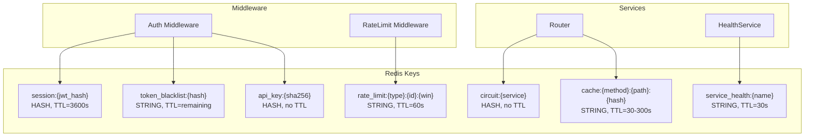

# 🌐 API Gateway — Модель данных (Redis)

> Тег: `АКТУАЛЬНО` | Обновлён: `2026-06-02` | Версия: `1.0`

## Обзор

API Gateway не использует PostgreSQL. Все данные хранятся в Redis.

---

## Redis ключи

### 1. Сессии (JWT Cache)

| Ключ | Тип | TTL | Описание |
|------|-----|-----|----------|
| `session:{jwt_hash}` | HASH | = JWT expiry | Кэш расшифрованного JWT |

```
HSET session:abc123
  userId "uuid"
  organizationId "uuid"
  email "admin@company.com"
  roles '["admin","operator"]'
  createdAt "2026-06-02T10:00:00Z"
EXPIRE session:abc123 3600
```

**Зачем:** чтобы не парсить JWT при каждом запросе. При logout — `DEL session:{hash}`.

### 2. Token Blacklist

| Ключ | Тип | TTL | Описание |
|------|-----|-----|----------|
| `token_blacklist:{jwt_hash}` | STRING | = оставшееся время JWT | Инвалидированные токены |

```
SET token_blacklist:xyz789 "revoked" EX 1800
```

**Проверка:** перед авторизацией → `EXISTS token_blacklist:{hash}`. Если 1 → 401.

### 3. Rate Limiting

| Ключ | Тип | TTL | Описание |
|------|-----|-----|----------|
| `rate_limit:{type}:{id}:{window}` | STRING (counter) | = window | Счётчик запросов |

```
# Пользователь
INCR rate_limit:user:uuid:1717318800
EXPIRE rate_limit:user:uuid:1717318800 60

# API Key
INCR rate_limit:apikey:key-1:1717318800
EXPIRE rate_limit:apikey:key-1:1717318800 60

# IP (неаутентифицированный)
INCR rate_limit:ip:192.168.1.1:1717318800
EXPIRE rate_limit:ip:192.168.1.1:1717318800 60
```

**Window:** Unix timestamp поделённый на 60 (минутное окно).

### 4. API Keys

| Ключ | Тип | TTL | Описание |
|------|-----|-----|----------|
| `api_key:{sha256_hash}` | HASH | — | Данные API-ключа |

```
HSET api_key:sha256_of_key
  organizationId "uuid"
  name "Wialon Integration"
  permissions '["devices:read","positions:read"]'
  rateLimit 200
  isActive "true"
  createdAt "2026-01-15T10:00:00Z"
```

### 5. Circuit Breaker

| Ключ | Тип | TTL | Описание |
|------|-----|-----|----------|
| `circuit:{serviceName}` | HASH | — | Состояние circuit breaker |

```
HSET circuit:device-manager
  state "closed"            # closed | open | half_open
  failures 0
  lastFailure ""
  openedAt ""
  successes 0               # для half_open → closed
```

### 6. Response Cache

| Ключ | Тип | TTL | Описание |
|------|-----|-----|----------|
| `cache:{method}:{path}:{hash}` | STRING (JSON) | 30-300s | Кэш GET ответов |

```
SET cache:GET:/api/v1/dashboard:org-uuid '{"vehicles":{"total":150},...}' EX 30
```

**Кэшируются:**
- `GET /api/v1/dashboard` — TTL 30s
- `GET /api/v1/devices` (list) — TTL 60s
- `GET /api/v1/reports/*` — TTL 300s

**НЕ кэшируются:**
- POST, PUT, DELETE запросы
- Запросы с `Cache-Control: no-cache`
- Запросы с кастомными query параметрами (кроме пагинации)

### 7. Service Health

| Ключ | Тип | TTL | Описание |
|------|-----|-----|----------|
| `service_health:{name}` | STRING | 30s | Последний статус health check |

```
SET service_health:device-manager "up" EX 30
```

---

## Scala Domain Models

```scala
// Контекст аутентифицированного пользователя
final case class UserContext(
  userId: UUID,
  organizationId: UUID,
  email: String,
  roles: List[String]
)

// Контекст API-ключа
final case class ApiKeyContext(
  organizationId: UUID,
  name: String,
  permissions: List[String],
  rateLimit: Int
)

// Результат аутентификации
sealed trait AuthResult
object AuthResult:
  case class JwtAuth(user: UserContext) extends AuthResult
  case class ApiKeyAuth(key: ApiKeyContext) extends AuthResult
  case object Anonymous extends AuthResult

// Конфигурация backend-сервиса
final case class ServiceConfig(
  name: String,
  baseUrl: String,
  timeout: Duration,
  circuitBreaker: CircuitBreakerConfig
)

final case class CircuitBreakerConfig(
  failureThreshold: Int,
  timeout: Duration,
  halfOpenMaxProbes: Int,
  resetTimeout: Duration
)

// Состояние circuit breaker
enum CircuitState:
  case Closed, Open, HalfOpen

// Маршрут
final case class RouteRule(
  pathPrefix: String,
  serviceName: String,
  methods: Set[String],
  authRequired: Boolean,
  cacheTtl: Option[Duration]
)

// Ошибки gateway
sealed trait GatewayError
object GatewayError:
  case class Unauthorized(message: String) extends GatewayError
  case class Forbidden(message: String) extends GatewayError
  case class RateLimitExceeded(retryAfter: Int) extends GatewayError
  case class ServiceUnavailable(service: String, retryAfter: Int) extends GatewayError
  case class BadGateway(service: String, cause: String) extends GatewayError
  case class GatewayTimeout(service: String) extends GatewayError
  case class RouteNotFound(path: String) extends GatewayError
  case class InvalidRequest(message: String) extends GatewayError

// Dashboard
final case class DashboardResponse(
  vehicles: Option[VehicleSummary],
  alerts: Option[AlertSummary],
  geozones: Option[GeozoneSummary],
  maintenance: Option[MaintenanceSummary]
)
```

---

## Диаграмма Redis


