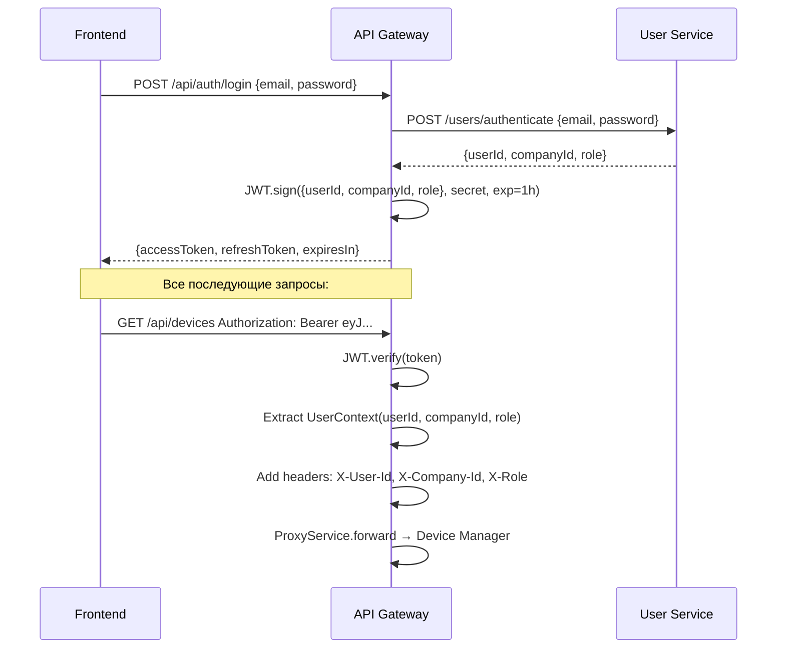

> Тег: `АКТУАЛЬНО` | Обновлён: `2026-03-02` | Версия: `1.0`

# 📖 Изучение API Gateway

> Руководство по API Gateway — единой точке входа для всех клиентов.

---

## 1. Назначение

**API Gateway** — единственная публичная точка входа:
- JWT аутентификация (выдача и проверка токенов)
- CORS middleware
- Проксирование запросов к backend-сервисам
- Rate limiting для защиты от злоупотреблений
- Логирование всех входящих запросов
- Health aggregation с проверкой downstream-сервисов

**Порт:** 8080 (публичный, единственный открытый наружу)

---

## 2. Архитектура

```
[Frontend / Mobile] → API Gateway (8080)
                        ├── AuthMiddleware (JWT verify)
                        ├── CorsMiddleware
                        ├── LogMiddleware
                        └── ApiRouter
                            ├── /api/auth/*      → AuthService (JWT внутри GW)
                            ├── /api/devices/*   → ProxyService → Device Manager (8092)
                            ├── /api/history/*   → ProxyService → History Writer (8091)
                            ├── /api/geozones/*  → ProxyService → Rule Checker (8093)
                            ├── /api/users/*     → ProxyService → User Service (8091)
                            ├── /api/reports/*   → ProxyService → Analytics Service (8095)
                            └── /api/admin/*     → ProxyService → Admin Service (8097)
```

### Компоненты

| Файл | Назначение |
|------|-----------|
| `middleware/AuthMiddleware.scala` | JWT verify, extract UserContext |
| `middleware/CorsMiddleware.scala` | CORS headers |
| `middleware/LogMiddleware.scala` | Request/response logging |
| `routing/ApiRouter.scala` | Маршрутизация по prefix → backend |
| `service/AuthService.scala` | Login, JWT issue, refresh token |
| `service/ProxyService.scala` | HTTP proxy (zio-http Client) |
| `service/HealthService.scala` | Проверка здоровья downstream |
| `config/GatewayConfig.scala` | Backend URLs, JWT secret, CORS origins |

---

## 3. JWT аутентификация



**Заголовки при проксировании:**
- `X-User-Id` — ID пользователя из JWT
- `X-Company-Id` — ID компании (organization_id) 
- `X-Role` — Роль пользователя

Backend-сервисы доверяют этим заголовкам (они приходят только от GW).

---

## 4. ProxyService — как работает

```scala
// Маршрутизация по prefix:
"/api/devices/*"   → "http://device-manager:8092"
"/api/history/*"   → "http://history-writer:8091"
"/api/geozones/*"  → "http://rule-checker:8093"
"/api/rules/*"     → "http://rule-checker:8093"
"/api/users/*"     → "http://user-service:8091"
"/api/reports/*"   → "http://analytics-service:8095"
"/api/admin/*"     → "http://admin-service:8097"
"/api/maintenance/*" → "http://maintenance-service:8087"
"/api/sensors/*"   → "http://sensors-service:8098"
"/api/notifications/*" → "http://notification-service:8094"
"/api/integrations/*" → "http://integration-service:8096"
```

ProxyService использует `zio-http Client`:
- Перенаправляет запрос, заменяя host и добавляя X-заголовки
- Timeout: 30 секунд
- При ошибке downstream → 502 Bad Gateway

---

## 5. API endpoints (собственные)

```bash
# Аутентификация (обрабатывает сам GW)
POST /api/auth/login       # {email, password} → {accessToken, refreshToken}
POST /api/auth/refresh     # {refreshToken} → {accessToken}
POST /api/auth/logout      # Инвалидация токена

# Текущий юзер
GET  /api/auth/me          # Информация о текущем пользователе

# Health
GET  /health               # Здоровье GW + downstream сервисов
```

---

## 6. Конфигурация

```hocon
gateway {
  port = 8080
  jwt {
    secret = ${JWT_SECRET}
    expiration = 1h
    refresh-expiration = 7d
  }
  cors {
    allowed-origins = ["http://localhost:3001", "https://app.wayrecall.com"]
  }
  backends {
    device-manager = "http://device-manager:8092"
    history-writer = "http://history-writer:8091"
    rule-checker = "http://rule-checker:8093"
    # ...
  }
}
```

---

## 7. Зависимости

- **Redis (lettuce)** — хранение сессий, blacklist токенов
- **jwt-zio-json** — JWT encode/decode
- **zio-http Client** — проксирование HTTP
- **User Service** — проверка credentials при login

---

*Версия: 1.0 | Обновлён: 2 марта 2026*
